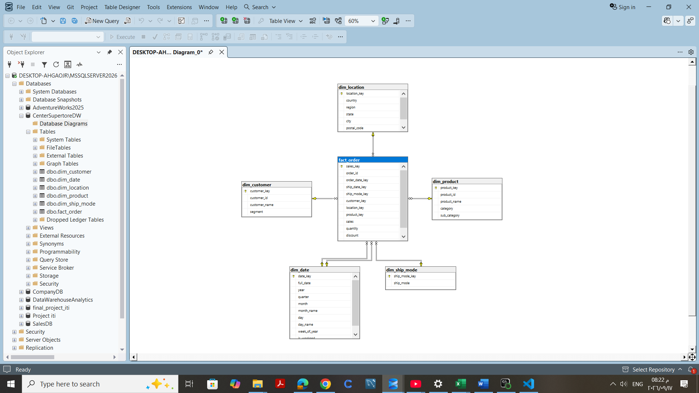

# Central Superstore Data Warehouse (SQL Server + Python)

An end-to-end data project: a Python ETL pipeline cleans the Superstore Central-region sales data, models it as a **star schema**, loads it into **SQL Server**, and a set of **T-SQL queries** answers business questions about products, customers, time trends and discounts.

## Objective
- Clean and validate raw sales data before loading it
- Design a dimensional model (fact + dimension tables) with keys and relationships
- Load the model into SQL Server using Python
- Analyze sales and profit with T-SQL (joins, CTEs, subqueries, window functions)
- Package reusable logic as a View and a Stored Procedure

## Dataset
- **File:** `Central_Superstore.xlsx`, Central region of the public Superstore sample dataset
- **Size:** 2,323 order lines, 21 columns
- **Scale:** 1,175 orders, 629 customers, 195 locations, 4 ship modes
- **Period:** orders from Jan 2013 to Dec 2016

## Tools
Python (pandas, NumPy, SQLAlchemy, pyodbc) · SQL Server (T-SQL) · Jupyter Notebook

## Architecture
```
Excel file  →  Python (clean + model)  →  SQL Server (star schema)  →  T-SQL analysis
```



## Data Model
**Grain:** one row in `fact_order` = one product line inside an order.

| Table | Type | Rows | Description |
|---|---|---|---|
| `fact_order` | Fact | 2,323 | Sales, quantity, discount, profit + foreign keys |
| `dim_customer` | Dimension | 629 | Customer ID, name, segment |
| `dim_product` | Dimension | 1,326 | Product ID, name, category, sub-category |
| `dim_location` | Dimension | 195 | Country, region, state, city, postal code |
| `dim_ship_mode` | Dimension | 4 | Shipping method |
| `dim_date` | Dimension | 1,058 | Order and ship dates with year, quarter, month, weekday and weekend flag |

`fact_order` references every dimension with foreign keys (the date dimension is used twice: order date and ship date).

## Data Preparation (Python)
1. **Profiling:** checked missing values (none), duplicate rows (none), and invalid values (no sales or quantity <= 0).
2. **Standardization:** snake_case column names and trimmed text columns.
3. **Key validation:** each Customer ID maps to exactly one name and segment. However, **16 Product IDs have more than one product name**, so `dim_product` is built on Product ID + name + category + sub-category with its own surrogate key, instead of Product ID alone. This avoids dropping or duplicating order lines.
4. **Modeling:** built 5 dimensions with surrogate keys, then joined them to create the fact table.
5. **Validation:** confirmed the fact table kept all 2,323 rows after the joins.
6. **Loading:** created tables with explicit data types, primary keys and foreign keys, then loaded them into SQL Server with SQLAlchemy.
7. **Verification:** re-read the data from SQL Server with a 5-table join to confirm the load.

## SQL Analysis
All queries are in [`analysis_queries.sql`](analysis_queries.sql).

| Business question | Techniques |
|---|---|
| Sales and profit per product, sub-category and category | JOIN, GROUP BY |
| Which order lines are losses, low, medium or high profit? | CASE |
| Which sub-categories earn above the average profit? | Subquery in HAVING |
| Sales and order count per customer segment | COUNT DISTINCT |
| Who are the top 10 customers? | TOP, ORDER BY |
| Which customers spend above average, and what tier are they (VIP / Regular / Occasional)? | CTE, CASE |
| One-time vs repeat customers | COUNT DISTINCT, CASE |
| What share of total sales does each segment contribute? | Multiple CTEs, CROSS JOIN |
| Yearly and monthly sales and profit trends | Date dimension |
| Month-over-month sales growth (%) | Window function (`LAG`), NULLIF |
| Weekend vs weekday sales | Date flags |
| How do discounts affect profit? | Discount bands with CASE |

**Reusable objects**
- `vw_monthly_sales_kpi`: View with monthly sales, profit and order count
- `usp_top_customers @top_n`: Stored Procedure returning the top N customers by sales

## Key Findings
**Overall:** 1,175 orders, **$501,240** in sales and **$39,706** in profit (7.9% margin).

**Products**
- **Technology** leads in profit ($33.7K on $170.4K sales). **Office Supplies** earns only $8.9K on $167.0K sales, and **Furniture** has $163.8K in sales but a **net loss of $2.9K**.
- **Copiers** are the most profitable sub-category ($15.6K profit on $37.3K sales), followed by **Phones** ($12.3K).
- **Chairs** have the highest sales ($85.2K) but only $6.6K profit.
- **7 of 17 sub-categories lose money.** The biggest losses are Furnishings (-$3.9K), Tables (-$3.6K) and Appliances (-$2.6K).
- Only 6 sub-categories beat the overall average profit per order line ($17.09): Copiers, Phones, Chairs, Accessories, Envelopes and Paper.
- **741 order lines (32%) are loss-making.**

**Customers**
- **Consumer** is the largest segment with 50.3% of sales ($252.0K, 604 orders), then Corporate with 31.5% ($158.0K, 348 orders) and Home Office with 18.2% ($91.2K, 223 orders).
- The top customer is **Tamara Chand** ($18.4K), followed by Adrian Barton ($12.2K) and Becky Martin ($10.5K).
- The average customer spends $797. 191 customers spend above that average: 10 are VIP (>= $5,000), 147 Regular and 34 Occasional.
- **345 of 629 customers (55%)** are repeat buyers; 284 bought only once.

**Time**
| Year | Sales | Profit |
|---|---|---|
| 2013 | $103.8K | $0.5K |
| 2014 | $102.9K | $11.7K |
| 2015 | $147.4K | $19.9K |
| 2016 | $147.1K | $7.6K |

- Sales were flat in 2016, but **profit dropped about 62%** compared with 2015.
- The best month is September 2013 ($34.4K) and the weakest is February 2015 ($1.1K). Month-over-month growth is very volatile, swinging from about -85% to over +1,000%.
- Weekdays account for 62% of sales (745 orders) and weekends for 38% (430 orders).

**Discounts**
| Discount band | Order lines | Avg profit per line |
|---|---|---|
| No discount | 828 | $91.94 |
| Low (up to 20%) | 852 | $18.75 |
| Medium (20% – 50%) | 205 | -$77.60 |
| High (over 50%) | 438 | -$83.30 |

Lines with no discount earn the most, and every line discounted above 20% loses money on average. This shows a relationship in the data, not proof of causation.

## Project Structure
```
├── etl_load_to_sql_server.ipynb   # cleaning, modeling, loading
├── analysis_queries.sql           # analysis queries, view, procedure
├── data/
│   └── Central_Superstore.xlsx    # source data
├── images/
│   └── star_schema_diagram.png    # data model
└── README.md
```

## How to Run
**Requirements:** SQL Server (Developer or Express), ODBC Driver 17 for SQL Server, Python 3.

1. Install the packages:
```bash
   pip install pandas numpy sqlalchemy pyodbc openpyxl jupyter
```
2. Create an empty database in SQL Server:
```sql
   CREATE DATABASE CenterSupertoreDW;
```
3. Start Jupyter from the project folder and open `etl_load_to_sql_server.ipynb`. Update `SQL_SERVER` and `SQL_DATABASE` in the connection cell (the notebook uses Windows Authentication).
4. Run the notebook from top to bottom. It creates and loads all tables.
5. Open `analysis_queries.sql` in SSMS and **run the queries one at a time**: select a query and press Execute (F5). Run the `CREATE VIEW` and `CREATE PROCEDURE` statements each on their own, because SQL Server requires them to be the only statement in their batch.

## Author
Taysser Mahmoud · [LinkedIn](https://www.linkedin.com/in/taysser-mahmoud)
